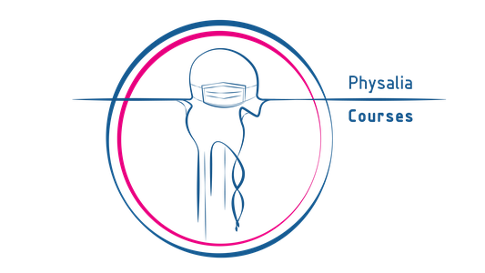

# Environmental metagenomics

## Instructors

- Dr. Antti Karkman, University of Helsinki
- Dr. Igor Pessi, Finnish Environment Institute (SYKE)

## Overview
Metagenomics is widely used for the analysis of microbial communities as it gives access to the genomes of uncultured microorganisms.
Particularly in complex ecosystems (e.g. soil), uncultured taxa comprise a large fraction of the microbial communities.
Metagenomics has many benefits compared to amplicon sequencing of marker genes (e.g. the 16S rRNA gene), as it gives information not only on the taxonomic diversity but also on the functional composition of microbial communities.
Recent bioinformatic developments now allow the recovery of metagenome-assembled genomes (MAGs) at an incredible depth.  

During this one week course you will learn state-of-the-art bioinformatic approaches to analyse metagenomic data.
We will cover both read- and assembly-based methods, focusing on the strength of each of these methods depending on the research question.
We will use data from both short- (e.g. Illumina) and long-read (e.g. Nanopore/PacBio) sequencing platforms, as it improves dramatically MAG assembling and binning compared to short-read-only methods.

## Pre-requisites
We assume some basic awareness of analysis of UNIX and molecular biology.  
Please follow the exercises [here](command-line-basics.md) to refresh your Unix skills if needed.  

## Outcomes
By completing this course, you will:

- Understand the basics of metagenomic sequencing and bioinformatic approaches to the analyis of metagenomic data
- Be able to plan and execute a metagenomic sequencing project
- Have an up-to-date knowledge on the bioinformatic tools and best practices for the analysis of metagenomes
- Be able to choose the right tools and approaches to answer your specific research question
- Have confidence to learn new methods needed to answer your research question

---

[**-- SCHEDULE --**](schedule.md)  

[**-- EXERCISES --**](exercises.md)
